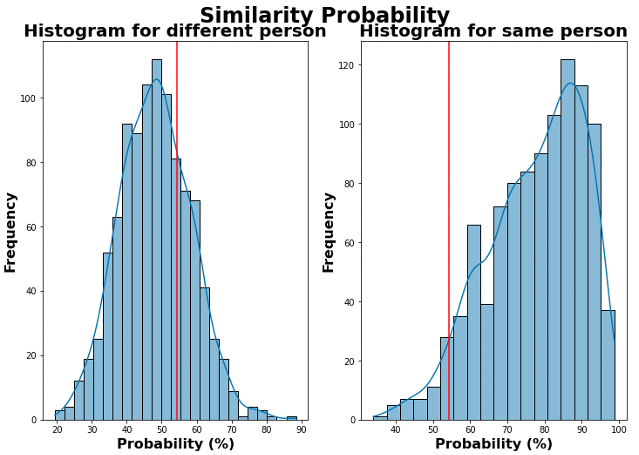

#  Capstone Project - Fine-tuning on VGG16 for Facial Recognition to Identify People of Interest

## Problem Statement

As Singapore is building towards a Smart Nation to improve the lives of citizen, the Smart City concept, with intelligent video analytics as one of its essential will become the basis of public security around Singapore.

This project aims to build a <u><strong>facial recognition model to identify people of interest</strong></u> which can be extended to aid law enforcement agencies such as ICA and the Police in identifying
* Missing people
* Criminals/Offenders
* Terrorists

in the future.

## Dataset

Datasets were self-sourced with 20 images each for 100 soccer stars via Google provided in the soccer-dataset folder in the dataset folder. 

The soccer-dataset in the dataset folder contains 100 players each with 20 images. These images are then splitted into the training, validation and test dataset ith ratio of 7:2:1 and then followed by image augmentation to expand the size of the dataset. Before feeding the images into the model for training, pre-processing of the images to crop the faces were then saved in a separate folder called processed-dataset which will be used to feed into the model for training, validation and evaluation purposes.

An exmaple of image augmentation is shown below:

## Executive Summary

For this project, there are 2 objectives:

1. Classification of the image of a face to the correct ID – metric used here will be the model accuracy

   

2. Similarity of faces in 2 different images – metric used here will be the cosine similarity to determine if 2 images are from the same or different person

   

In this project, the Multi-Task Cascaded Convolutional Neural Networks (MTCNN) was used to detect faces and then extract the faces to be passed to the feature extraction block. For the feature extraction block, transfer learning of VGG16 architecture was used to extract the most important features from an image of the face which can be used for facial similarity comparison. The extracted features can also be passed to the classification block, which is built by fully connected layers with softmax activation function as the output for multi-class classifications.

Below shows the block diagram of the facial recognition methodology:

These 8 models were evaluated using the test dataset and the table below shows the performance of each of the models:

Model  | Hidden Layer Nodes | Dropout Layers Values | Training Accuracy | Validation Accuracy | Test Accuracy | Remarks
-------------------|------------------|-------------------|------------------|------------------|--------------------|------------------|
Base Model | [128, 128] | - | 99% | 73.2% | 78.5% | Trained the last trainable layer of VGGFace
Base Model 2 | [128, 128] | - | 99% | 64.5% | 75.5% | Trained the last 2 trainable layers of VGGFace
Model 1 | [128, 128] | [0.1, 0.1] | 99% | 75% | 76.3% | Trained the last trainable layer of VGGFace
Model 2 | [256, 256] | [0.3, 0.3] | 97.8% | 78.7% | 81.5% | Trained the last trainable layer of VGGFace
Model 3 | [512, 512] | [0.4, 0.4] | 96.8% | 77.2% | 80.2% | Trained the last trainable layer of VGGFace
Model 4 | [128, 128, 128] | [0.1, 0.1, 0.1] | 98.8% | 74.3% | 78.2% | Trained the last trainable layer of VGGFace
Model 5| [256, 256, 256] | [0.3, 0.3, 0.3] | 97.4% | 75% | 78.4% | Trained the last trainable layer of VGGFace
Model 6 | [512, 512, 512] | [0.4, 0.4, 0.4] | 96.7% | 75.3% | 77.1% | Trained the last trainable layer of VGGFace

From the model performance summary table, Model 5 was chosen as the model to be used for this project considering that it has one of the best score among the training, validation and test accuracy at 97.4%, 75% and 78.4%. Another important metric is the cosine similarity which can determine how similar 2 face images are to identify people of interest which is the objective of this project.

Below shows the histogram distribution of 1000 random pair images for
1. 2 images of same person
2. 2 images of different person

   

The threshold was set at 54.4% as shown in the histogram above so that 95% of the pair-images can be correctly identified which came from the same person. This threshold was then set in Model 5 for testing which will be shown below.

## Classification Testing

<u>Image classification:</u>

<u>Video classification:</u>

The video classification video above can be found in the video folder in the testing-dataset folder saved as "video_out_class_model5.mp4".

## Similarity Testing

<u>Image-Image Test:</u>

2 Images were provided to check for the similarity:

<u>Image-Video Test</u>

An input image is given as the person of interest to be identified in a video.

Input Image of a Person Trained in Dataset:

Output Video:

The output video above can be found in the video folder in the testing-dataset folder saved as "video_out_sim_model5_5percent.mp4".

 

Input Image of a Person Not Trained in Dataset:

Output Video 2:

The output video 2 above can be found in the video folder in the testing-dataset folder saved as "tony_out_sim_model5_5percent.mp4"

## References

* [Keras VGGFace](https://github.com/jbrownlee/keras-vggface)